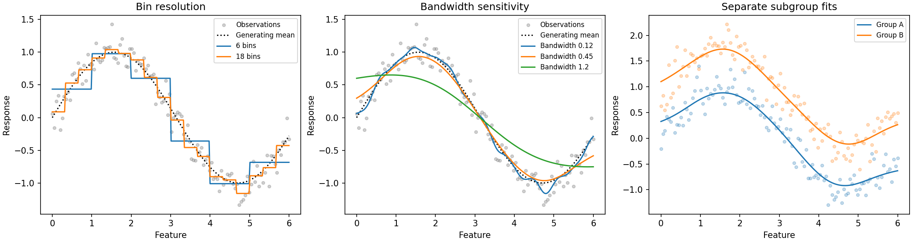

# Examples

These examples use synthetic data so the generating relationship is known.
Observed data usually do not supply that ground truth. For exact method details,
see the [API reference](api/index.md); for interpretation, see [theory](theory.md).

## Bin resolution, smoothing sensitivity, and subgroups



The first panel illustrates how finer bins resolve more local detail and can
also produce more variation. The second compares the same observations at three
bandwidths. The third fits each explicitly defined group separately on a common
feature range; it does not estimate an adjusted group effect.

Run from a checkout with plotting installed:

```bash
python examples/plot_relationships.py
# Or save a reproducible figure without a desktop:
python examples/plot_relationships.py --output docs/_static/relationships.png
```

Download {download}`the complete script <../examples/plot_relationships.py>`.

```{literalinclude} ../examples/plot_relationships.py
:language: python
:lines: 31-64
:dedent: 4
```

## Residual diagnostics and pointwise intervals

```python
import numpy as np
from rgram import KernelSmoother, plot_diagnostics

X = np.linspace(0, 5, 60)
y = np.sin(X) + np.random.default_rng(17).normal(0, 0.2, len(X))
model = KernelSmoother(
    kernel="gaussian", bandwidth="manual", bandwidth_value=0.5,
).fit(X, y)
figure, axes = plot_diagnostics(model, X, y)
print(model.regression_diagnostics(X, y))
print(model.predict_interval([1.0, 2.0, 3.0], n_resamples=100, random_state=17))
```

These intervals describe a fitted curve at three locations, not the response of
three future observations. Support and resampling assumptions still apply.

## Interactive kernel explorer

```bash
uv run python examples/kernel_explorer.py
```

The explorer provides controls for kernel, bandwidth, query location, local
constant/linear fitting, binning, and aggregation. It displays the response curve,
local influence weights, support counts, effective sample size, and fallback
flags. Bootstrap intervals are calculated only after pressing the interval button.
It requires Matplotlib and a desktop backend; a static GitHub Pages site cannot
run the Python widgets. Download {download}`the explorer script <../examples/kernel_explorer.py>`
and run it locally.

## Exact neighbor and brute-force paths

```bash
uv run python examples/benchmark_neighbors.py
```

This script supplies already sorted features and a compact tricube kernel, then
times the automatic support-window path against bounded brute-force prediction.
It verifies numerical agreement. Results depend on hardware, sample size,
query count, and bandwidth; they are not a universal speed claim. Download
{download}`the benchmark script <../examples/benchmark_neighbors.py>`.

## Pipelines, selection, weights, and EDA

The [scikit-learn guide](sklearn.md) contains complete examples for:

- `fit`, `predict`, `score`, cloning, and held-out MSE.
- Imputation/scaling pipelines and `GridSearchCV`.
- Selecting one feature from a wider Polars table.
- Step-prefixed observation weights.
- Bin, residual, grid, and plotting diagnostics.

Custom callback examples are in the [aggregation API](api/aggregation.md).
Coverage-aware parameter selection is illustrated in the
[CoverageSearchCV API](api/coverage_search.md).
